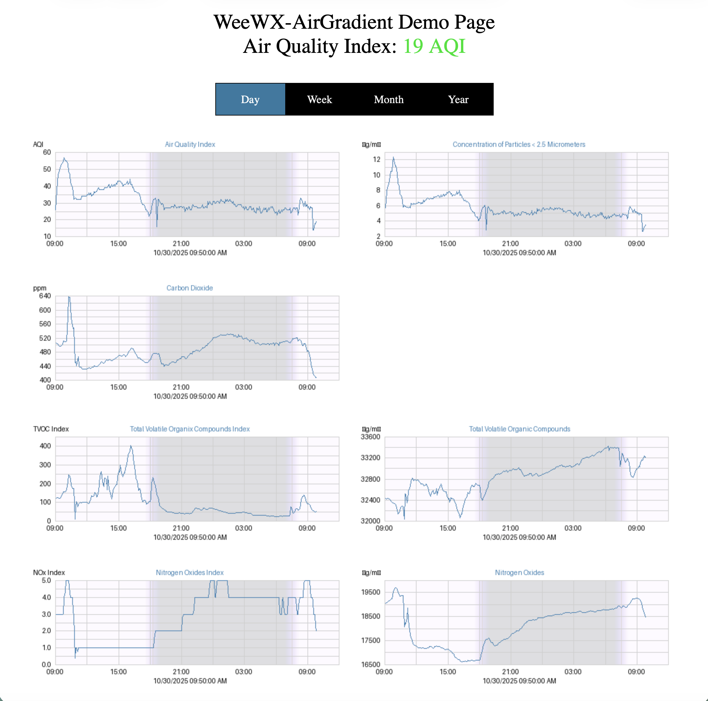

 weewx-airgradient
*Open source plugin for WeeWX software.

## Description

A WeeWX plugin that gets its AirGradient sensor readings either directly
from the AirGradient sensor or from a
[airgradient-proxy](https://github.com/chaunceygardiner/weewx-airgradient) service.

Copyright (C)2025 by John A Kline (john@johnkline.com)

**This plugin requires Python 3.9, WeeWX 5 and the
[wview_extended](https://github.com/weewx/weewx/blob/master/src/schemas/wview_extended.py)
schema.  The extension should install and run on WeeWX 4, but is not supported by the author.**

weewx-airgradient requires the
[wview_extended](https://github.com/weewx/weewx/blob/master/src/schemas/wview_extended.py)
in WeeWX 4 or 5 that contains `pm1_0`, `pm2_5` `pm10_0` and `co2` columns.  With the weewx-airgradient
extension, in the suggested setup, Loop records will be populated with `pm1_0`, `pm2_5`, `pm10_0` `co2`,
`nox`, `noxIndex`, `tvoc` and `tvocIndex`  fields that
correspond to AirGradient's `pm01`, `pm02Compensated`, `pm10` `rco2`, `noxRaw`, `noxIndex`,
`tvocRaw` and `tvocIndex` fields.

As mentioned above, in the suggested setup, weewx-airgradient inserts `tvoc`, `tvocIndex`, `nox` and `noxIndex`.
These fields are accessible in the current loop record with the `.current` syntax.  If one wishes to
have these fields saved in archive records, one will need to add these columns to the database.  This will
then make availble the full range of access to these fields (e.g., `day.nox.avg`).  The installation
instructions suggest the appropriate fields to add to the database.

In addition, AQI variables are also available (even though they are not in the
database) via WeeWX's [XTypes](https://github.com/weewx/weewx/wiki/WeeWX-V4-user-defined-types).
pm2_5_aqi is automatically computed from pm2_5 and can be used in reports
(`$current.pm2_5_aqi`) and in graphs `[[[[pm2_5_aqi]]]`.  Also available is
is the [RGBint](https://www.shodor.org/stella2java/rgbint.html) value
`pm2_5_aqi_color` (useful for displaying AQI in the appropriate color
(e.g., green for AQIs <= 50).

Note: The AQI index values conform to the [2024 EPA definition](https://www.epa.gov/system/files/documents/2024-02/pm-naaqs-air-quality-index-fact-sheet.pdf)

If the user does not want the AQI XType fields (`pm2_5_aqi` and `pm2_5_aqi_color`), it can be turned off with the following line in the `AirGradient` section of `weewx.conf`:
```
[AirGradient]
    enable_aqi = False
```

A skin is provided to show a sample report:


### Full List of Fields that are Avaiable to Add to Loop Records

Here's a full list of fields emitted by an AirGradient sensor.  Any or all of them can be added to Loop records with the appropriate
entries in the `[LoopFields]` section of `weewx.conf`'s `[AirGradient]` section.

```
    serialno        :  Serial Number of the monitor
    wifi            :  WiFi signal strength
    pm01            :  PM1.0 in ug/m3 (atmospheric environment)
    pm02            :  PM2.5 in ug/m3 (atmospheric environment)
    pm10            :  PM10 in ug/m3 (atmospheric environment)
    pm02Compensated :  PM2.5 in ug/m3 with correction applied (from fw version 3.1.4 onwards)
    pm01Standard    :  PM1.0 in ug/m3 (standard particle)
    pm02Standard    :  PM2.5 in ug/m3 (standard particle)
    pm10Standard    :  PM10 in ug/m3 (standard particle)
    rco2            :  CO2 in ppm
    pm003Count      :  Particle count 0.3um per dL
    pm005Count      :  Particle count 0.5um per dL
    pm01Count       :  Particle count 1.0um per dL
    pm02Count       :  Particle count 2.5um per dL
    pm50Count       :  Particle count 5.0um per dL **Only aviable with the AirGradient Now**
    pm10Count       :  Particle count 10um per dL **Only aviable with the AirGradient Now**
    atmp            :  Temperature in Degrees Celsius **Will be converted to match units of Loop record.**
    atmpCompensated :  Temperature in Degrees Celsius with correction applied **Will be converted to match units of Loop record.**
    rhum            :  Relative Humidity
    rhumCompensated :  Relative Humidity with correction applied
    tvocIndex       :  Senisiron VOC Index
    tvocRaw         :  VOC raw value
    noxIndex        :  Senisirion NOx Index
    noxRaw          :  NOx raw value
    boot            :  Counts every measurement cycle. Low boot counts indicate restarts.
    bootCount       :  Same as boot property. Required for Home Assistant compatability. (deprecated soon!)
    ledMode         :  Current configuration of the LED mode **Only aviable with the AirGradient Now**
    firmware        :  Current firmware version
    model           :  Current model name
```


### What's an airgradient-proxy?

airgradient-proxy is optional when using weewx-airgradient.  airgradient-proxy
returns an average over the archive period when queried.  Use of airgradient-proxy
is not recommended (and strongly discouraged for all but the most Unix/Linux
savvy).  The install is rather crude and has only been tested on Debian.
If in doubt, skip airgradient-proxy and query the AirGradient devices directly.

# Installation Instructions

If you don't meet the following requirements, don't install this extension.
  * WeeWX 4 or 5
  * Using WeeWX 4's new wview_extended schema.
  * Python 3.9 or greater

## WeeWX 5 Installation Instructions

1. If pip install,
   Activate the virtual environment (actual syntax varies by type of WeeWX install):
   `/home/weewx/weewx-venv/bin/activate`
   Install the dateutil package.
   `pip install python-dateutil`
   Install the requests package.
   `pip install requests`

1. If package install:
   Install python3's dateutil package.  On debian, that can be accomplished with:
   `apt install python3-dateutil`
   Install python3's requests package.  On debian, that can be accomplished with:
   `apt install python3-requests`

1. Download the lastest release, weewx-airgradient.zip, from the
   [GitHub Repository](https://github.com/chaunceygardiner/weewx-airgradient).

1. Install the airgradient extension.

   `weectl extension install weewx-airgradient.zip`

1. Edit the `AirGradient` section of weewx.conf (which was created by the install
   above).

   AirGradient sensors are specified with section names of `Sensor1`,
   `Sensor2`, `Sensor3`, etc.  Proxies are specified as `Proxy1`, `Proxy2`,
   `Proxy3`, etc.  There is no limit on how many sensors and proxies can
   be configured; but the numbering must be sonsecutive.  The order in which
   sensors/proxies are interrogated is first the proxies, low numbers to high;
   then the sensors, low numbers to high.  Once a proxy or sensor replies,
   no further proxies/sensors are interrogated for the current polling round.

   The fields to write to Loop records are specified in the `LoopFields` section.
   The suggested default is shown below.  To achieve this default, you'll need to
   add the following to the `LoopFields` section of `AirGradient` in `weewx.conf`.

   ```
   pm01 = pm1_0
   pm02Compensated = pm2_5
   pm10 = pm10_0
   rco2 = co2
   tvocIndex = tvocIndex
   tvocRaw = tvoc
   noxIndex = noxIndex
   noxRaw = nox
   ```
   If one forgets ths step, no fields will be written to the Loop record and
   it will appear the extension is not working.  Although the suggested fields
   are a good default, any field emitted by the AirGradient sensor
   can be added here.  The right side of the equation specifies the name to
   be used in the Loop record.  In the default, the pmXXX names and co2 are
   chosen to match WeeWX's extended schema.  The `tvoc`, `tvocIndex`, `nox` and
   `noxIndex` fields are not in the schema, but adding them to the schema will be
   suggested below.

   ```
   [AirGradient]
       poll_secs = 15
       [[LoopFields]]
           pm01 = pm1_0
           pm02Copmensateed = pm2_5
           pm10 = pm10_0
           rco2 = co2
           tvocIndex = tvocIndex
           tvocRaw = tvoc
           noxIndex = noxIndex
           noxRaw = nox
       [[Sensor]]
           enable = true
           hostname = airgradient
           port = 80
           timeout = 10
       [[Sensor2]]
           enable = false
           hostname = airgradient2
           port = 80
           timeout = 10
       [[Proxy1]]
           enable = false
           hostname = proxy
           port = 8080
           timeout = 10
           starup_timeout = 60
       [[Proxy2]]
           enable = false
           hostname = proxy2
           port = 8080
           timeout = 10
           starup_timeout = 60
       [[Proxy3]]
           enable = false
           hostname = proxy3
           port = 8080
           timeout = 10
           starup_timeout = 60
       [[Proxy4]]
           enable = false
           hostname = proxy4
           port = 8080
           timeout = 10
           starup_timeout = 60
   ```

1. Optionally, add the `tvocIndex`, `tvocRaw`, `noxIndex` and `noxRaw` columns to the weewx database.
   Performing this step will result in WeeWX including these fields in archive records so one will
   get highs, lows, averages, etc.  And one will be able to generate graphs.

   ```
   sudo systemctl stop weewx
   /home/weewx/weewx-venv/bin/activate
   weectl database add-column tvoc --type=REAL
   weectl database add-column tvocIndex --type=REAL
   weectl database add-column nox --type=REAL
   weectl database add-column noxIndex --type=REAL
   sudo systemctl start weewx
   ```

1. If you are Unix/Linux savvy, and are willing to work with a crude
   installation procedure, install
   [airgradient-proxy](https://github.com/chaunceygardiner/airgradient-proxy).

1. Restart WeeWX

1. To check for a successful install, wait for a reporting cycle, then
   navigate in a browser to the WeeWX site and add /airgradient to the end
   of the URL (e.g., http://weewx-machine/weewx/airgradient).
   The graphs will fill in over time.

## WeeWX 4 Installation Instructions (installing in WeeWX 4 is not supported by the author)

This will be a lot like the apt install above, but the utilities are different in WeeWX 4.

# How to access weewx-airgradient fields in reports.

Detailed instructions are pending, below is a quick and dirty set of instructions.
At present, one will need to browse the code for more detail.

Note: Although the examples below show the use of $current, aggregates are also
supported (e.g., the high PM2.5 for the week can be presented with `$week.pm2_5.max`.

To show the PM2.5 reading, use the following:
```
$current.pm2_5
```

To show the maximum PM2.5 today, use the following:
```
$day.pm2_5.max
```

To show the Air Quality Index:
```
$current.pm2_5_aqi
```

To get the RGBINT color of the current Air Quality Index:
```
#set $color = int($current.pm2_5_aqi_color.raw)
#set $blue  =  $color & 255
#set $green = ($color >> 8) & 255
#set $red   = ($color >> 16) & 255
```

To show the PM1.0 reading, use the following:
```
$current.pm1_0
```

To show the PM10.0 reading, use the following:
```
$current.pm10_0
```

To show the CO2 reading, use the following:
```
$current.co2
```

To show the NOx reading, use the following:
```
$current.nox
```

To show the NOx Index reading, use the following:
```
$current.noxIndex
```

To show the TVOC reading, use the following:
```
$current.tvoc
```

To show the TVOC Index reading, use the following:
```
$current.tvocIndex
```


## Having AirGradient's Extra Air Quality Sensors is Great, but I'm Already Running a PurpleAir Extension!

The author of this extension is in the same boat.  If you want to keep PurpleAir readings for PM 1.0,
PM 2.5 and PM 10.0, simply set up your `weewx.conf` `AirGradient` section as follows:

```
[AirGradient]
    enable_aqi = False
    [[LoopFields]]
        rco2 = co2
        tvocIndex = tvocIndex
        tvocRaw = tvoc
        noxIndex = noxIndex
        noxRaw = nox
    .
    .
    .
```

In the above snippet, the AQI XType is turned off and `pm01`, `pmo2Compensated` and `pm10` are
not written to Loop records.  With these settings, the pm values and the AQI are left to the
other extenson you are runnnig (e.g., (weewx-purple](https://github.com/chaunceygardiner/weewx-purple)))


## Licensing

weewx-airgradient is licensed under the GNU Public License v3.
