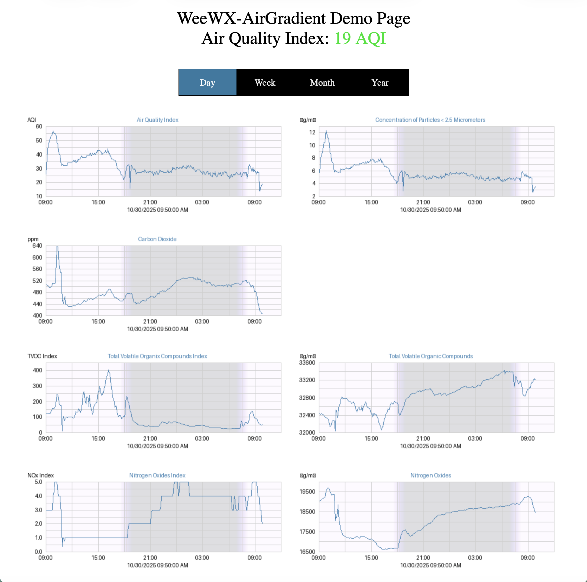

# weewx-airgradient

A WeeWX extension that reads an [AirGradient](https://www.airgradient.com/)
air quality monitor on the local network (or an
[airgradient-proxy](https://github.com/chaunceygardiner/airgradient-proxy)
service) and inserts the readings — particulates, CO2, TVOC, NOx and more —
into every WeeWX loop packet.

Copyright (C) 2025-2026 by John A Kline (john@johnkline.com)

**Requires:**
* WeeWX 4 or 5
* Python 3.9 or greater
* The [wview_extended](https://github.com/weewx/weewx/blob/master/src/schemas/wview_extended.py)
  schema (it contains the `pm1_0`, `pm2_5`, `pm10_0` and `co2` columns)
* The `python-dateutil` and `requests` Python packages
* An AirGradient monitor reachable on your local network

Not sure about the schema?  wview_extended is the default for new WeeWX 4
and 5 installs; only databases created under WeeWX 3 and carried forward
still use the old schema.  To check, look for `pm2_5` in your archive
table, e.g.:

```
echo '.schema archive' | sqlite3 /var/lib/weewx/weewx.sdb | grep pm2_5
```

## What it does

With the suggested `[LoopFields]` mapping (shown in Configuration below),
every loop packet is populated with:

| Loop field  | AirGradient field | Contents                                        |
|-------------|-------------------|-------------------------------------------------|
| `pm1_0`     | `pm01`            | PM1.0 concentration (µg/m³)                     |
| `pm2_5`     | `pm02Compensated` | PM2.5 concentration (µg/m³), compensated        |
| `pm10_0`    | `pm10`            | PM10.0 concentration (µg/m³)                    |
| `co2`       | `rco2`            | CO2 (ppm)                                       |
| `tvocIndex` | `tvocIndex`       | Sensirion TVOC index                            |
| `tvoc`      | `tvocRaw`         | TVOC raw value                                  |
| `noxIndex`  | `noxIndex`        | Sensirion NOx index                             |
| `nox`       | `noxRaw`          | NOx raw value                                   |

The `pm1_0`, `pm2_5`, `pm10_0` and `co2` fields are in the wview_extended
schema, so WeeWX accumulates them into archive records (and history graphs)
with no extra configuration.  The TVOC and NOx fields are not in the schema;
they are available in reports via `$current`, and a later section shows how
to add database columns for them if you want aggregates and graphs.

Two more observation types are available everywhere in reports and graphs —
without being stored in the database — via WeeWX
[XTypes](https://github.com/weewx/weewx/wiki/WeeWX-V4-user-defined-types):

| Field              | Contents                                                         |
|--------------------|------------------------------------------------------------------|
| `pm2_5_aqi`        | US EPA Air Quality Index computed from `pm2_5` (2024 definition) |
| `pm2_5_aqi_color`  | The RGB color of the AQI category, as a single integer           |

Readings are sanity checked: a reading is rejected if fields are
non-numeric or if the reading is stale.  If multiple monitors/proxies are
configured, they are tried in order until one produces a good reading.

### AQI categories

`pm2_5_aqi` conforms to the
[2024 EPA AQI definition](https://www.epa.gov/system/files/documents/2024-02/pm-naaqs-air-quality-index-fact-sheet.pdf);
`pm2_5_aqi_color` uses the EPA-defined RGB colors:

| Category                       | AQI       | 24-hr PM2.5 (µg/m³) | Color  | RGB           |
|--------------------------------|-----------|---------------------|--------|---------------|
| Good                           | 0 - 50    | 0.0 - 9.0           | Green  | (0, 228, 0)   |
| Moderate                       | 51 - 100  | 9.1 - 35.4          | Yellow | (255, 255, 0) |
| Unhealthy for Sensitive Groups | 101 - 150 | 35.5 - 55.4         | Orange | (255, 126, 0) |
| Unhealthy                      | 151 - 200 | 55.5 - 125.4        | Red    | (255, 0, 0)   |
| Very Unhealthy                 | 201 - 300 | 125.5 - 225.4       | Purple | (143, 63, 151)|
| Hazardous                      | 301 - 500 | 225.5 - 325.4       | Maroon | (126, 0, 35)  |

Concentrations above 325.4 µg/m³ map to AQI values above 500, continuing on
the same slope as AQI 301-500 (per the May 2024
[AirNow Technical Assistance Document](https://document.airnow.gov/technical-assistance-document-for-the-reporting-of-daily-air-quailty.pdf)).
The category and color remain Hazardous/Maroon.

The AQI is computed from `pm2_5` — with the suggested mapping, that is
AirGradient's compensated PM2.5 reading (`pm02Compensated`).  If you don't
want the AQI xtype (for instance, because another extension already
provides it), turn it off:

```
[AirGradient]
    enable_aqi = False
```

### Demo skin

A small demo report is installed at `<HTML_ROOT>/airgradient`:



### What's airgradient-proxy?

[airgradient-proxy](https://github.com/chaunceygardiner/airgradient-proxy)
is an optional service that averages sensor readings over the archive
period.  Its install is crude and has only been tested on Debian; use of
airgradient-proxy is discouraged for all but the most Unix/Linux savvy.  If
in doubt, skip it and query the AirGradient monitor directly.

# Installation

1. Find your monitor on the network and verify you can reach it.

   Find the monitor's IP address (e.g., in your router's DHCP client list
   or the AirGradient dashboard), then browse to
   `http://<monitor-ip>/measures/current`.  You should see a page of JSON
   sensor data — that is exactly the endpoint this extension polls.  Since
   the extension needs a stable address, give the monitor a DHCP
   reservation in your router (or a hostname in local DNS) so its address
   doesn't change.

1. Install the prerequisite Python packages.

   For a WeeWX pip install, activate WeeWX's virtual environment first, then:

   ```
   pip install python-dateutil requests
   ```

   For a Debian package install of WeeWX:

   ```
   apt install python3-dateutil python3-requests
   ```

1. Download the latest release, `weewx-airgradient.zip`, from the
   [GitHub repository](https://github.com/chaunceygardiner/weewx-airgradient).

1. Install the extension and restart WeeWX.

   WeeWX 5:

   ```
   weectl extension install weewx-airgradient.zip
   ```

   WeeWX 4 (adjust the path if WeeWX is not installed in /home/weewx):

   ```
   sudo /home/weewx/bin/wee_extension --install weewx-airgradient.zip
   ```

1. Edit the `[AirGradient]` section of weewx.conf (created by the install)
   to point at your monitor and fill in the `[[LoopFields]]` mapping (see
   Configuration below), then restart WeeWX.

1. To check the install, wait for a reporting cycle, then browse to the
   WeeWX site with `/airgradient` appended to the URL
   (e.g., `http://weewx-machine/weewx/airgradient`).  The graphs fill in
   over time.

## Configuration

```
[AirGradient]
    poll_secs = 15
    [[LoopFields]]
        pm01 = pm1_0
        pm02Compensated = pm2_5
        pm10 = pm10_0
        rco2 = co2
        tvocIndex = tvocIndex
        tvocRaw = tvoc
        noxIndex = noxIndex
        noxRaw = nox
    [[Sensor1]]
        enable = true
        hostname = airgradient
        port = 80
        timeout = 15
    [[Sensor2]]
        enable = false
        hostname = airgradient2
        port = 80
        timeout = 15
    [[Proxy1]]
        enable = false
        hostname = proxy1
        port = 8080
        timeout = 5
```

| Option      | Default                    | Meaning                                       |
|-------------|----------------------------|-----------------------------------------------|
| `poll_secs` | 15                         | How often to poll for a new reading (seconds) |
| `enable_aqi`| true                       | Whether to register the AQI xtype             |
| `enable`    | false                      | Whether this source is polled                 |
| `hostname`  |                            | Hostname or IP address of the monitor/proxy   |
| `port`      | 80 (sensor) / 8080 (proxy) | Port to connect on                            |
| `timeout`   | 10                         | HTTP timeout (seconds)                        |

AirGradient monitors are specified with subsections `[[Sensor1]]`,
`[[Sensor2]]`, etc.; airgradient-proxy services with `[[Proxy1]]`,
`[[Proxy2]]`, etc.  There is no limit on the number of sensors and proxies,
but the numbering of each group must start at 1 and be consecutive (a gap
ends the scan).  On each polling round, proxies are interrogated first (low
numbers to high), then sensors; the first source that yields a sane, fresh
reading wins and no further sources are tried.

A reading is considered fresh for `max(120, 3 * poll_secs)` seconds; stale
readings are never inserted into loop packets.

### The [[LoopFields]] mapping

Each entry maps an AirGradient field (left side) to the loop-packet field
it should be written to (right side).  The installer creates the section
empty — copy in the suggested mapping shown above (or your own subset).
Without entries, no fields are written to loop packets; the extension logs
an error at startup to that effect.  The section is deliberately not
prefilled by the installer: on upgrade, weectl merges installer defaults
into your existing section, which would inject unwanted entries into a
customized mapping.

Any field the monitor reports can be mapped.  The full list:

| AirGradient field | Contents                                                         |
|-------------------|------------------------------------------------------------------|
| `serialno`        | Serial number of the monitor                                     |
| `wifi`            | WiFi signal strength                                             |
| `pm01`            | PM1.0 in µg/m³ (atmospheric environment)                         |
| `pm02`            | PM2.5 in µg/m³ (atmospheric environment)                         |
| `pm10`            | PM10 in µg/m³ (atmospheric environment)                          |
| `pm02Compensated` | PM2.5 in µg/m³ with correction applied (firmware 3.1.4 onwards)  |
| `pm01Standard`    | PM1.0 in µg/m³ (standard particle)                               |
| `pm02Standard`    | PM2.5 in µg/m³ (standard particle)                               |
| `pm10Standard`    | PM10 in µg/m³ (standard particle)                                |
| `rco2`            | CO2 in ppm                                                       |
| `pm003Count`      | Particle count 0.3µm per dL                                      |
| `pm005Count`      | Particle count 0.5µm per dL                                      |
| `pm01Count`       | Particle count 1.0µm per dL                                      |
| `pm02Count`       | Particle count 2.5µm per dL                                      |
| `pm50Count`       | Particle count 5.0µm per dL (indoor monitors only)               |
| `pm10Count`       | Particle count 10µm per dL (indoor monitors only)                |
| `atmp`            | Temperature in °C (converted to the loop packet's unit system)   |
| `atmpCompensated` | Temperature in °C with correction applied (converted, as above)  |
| `rhum`            | Relative humidity                                                |
| `rhumCompensated` | Relative humidity with correction applied                        |
| `tvocIndex`       | Sensirion VOC index                                              |
| `tvocRaw`         | VOC raw value                                                    |
| `noxIndex`        | Sensirion NOx index                                              |
| `noxRaw`          | NOx raw value                                                    |
| `boot`            | Counts every measurement cycle; low counts indicate restarts     |
| `bootCount`       | Same as boot (Home Assistant compatibility; deprecated)          |
| `ledMode`         | Current configuration of the LED mode                            |
| `firmware`        | Current firmware version                                         |
| `model`           | Current model name                                               |

All fields are optional: AirGradient models differ in which fields they
report, and missing fields are simply skipped.

### Adding TVOC/NOx columns to the database (optional)

`tvoc`, `tvocIndex`, `nox` and `noxIndex` are not in the wview_extended
schema, so out of the box they are only available as current values.  To
get archive records, aggregates (`$day.nox.avg`) and graphs for them, add
the columns:

```
sudo systemctl stop weewx
source /home/weewx/weewx-venv/bin/activate
weectl database add-column tvoc --type=REAL
weectl database add-column tvocIndex --type=REAL
weectl database add-column nox --type=REAL
weectl database add-column noxIndex --type=REAL
sudo systemctl start weewx
```

# Using weewx-airgradient fields in reports

Current values:

```
$current.pm1_0
$current.pm2_5
$current.pm10_0
$current.co2
$current.tvoc
$current.tvocIndex
$current.nox
$current.noxIndex
$current.pm2_5_aqi
$current.pm2_5_aqi_color
```

Aggregates work for both the database-backed fields and the AQI xtypes
(supported AQI aggregates: `avg`, `min`, `max`, `first`, `last`, `count`):

```
$day.pm2_5.max
$week.co2.avg
$day.pm2_5_aqi.max
```

Both `pm2_5_aqi` and `pm2_5_aqi_color` can also be graphed, e.g. in
skin.conf's `[ImageGenerator]` section:

```
        [[[dayaqi]]]
            [[[[pm2_5_aqi]]]]
```

`pm2_5_aqi_color` is an [RGBint](https://www.shodor.org/stella2java/rgbint.html)
value, useful for displaying the AQI in the color of its category.  To unpack
it in a Cheetah template:

```
#set $color = int($current.pm2_5_aqi_color.raw)
#set $blue  =  $color & 255
#set $green = ($color >> 8) & 255
#set $red   = ($color >> 16) & 255
```

## How AQI values are computed (and stored)

AQI is always computed on demand from the stored `pm2_5` concentration —
there is no AQI column in the database, and none is needed: `$current`,
aggregates and graphs all resolve through the extension's AQI xtype.  For
real-time consumers (e.g., MQTT), `pm2_5_aqi` and `pm2_5_aqi_color` are
also present in every LOOP packet (unless `enable_aqi = false`).

To keep the on-demand computation authoritative, the extension registers
`extractor = noop` for both AQI fields so that WeeWX's accumulator does
not average them into archive records (averaging AQI values is
meaningless, since AQI is a non-linear transform of concentration).  An
`[Accumulator]` section in weewx.conf takes precedence if you
deliberately want different behavior.

If you added a `pm2_5_aqi` (or `pm2_5_aqi_color`) column to your database
schema — e.g., to feed Grafana directly — the accumulator no longer fills
it; have WeeWX compute it through the xtype instead, which stores
correctly EPA-rounded values:

```
[StdWXCalculate]
    [[Calculations]]
        pm2_5_aqi = prefer_hardware
        pm2_5_aqi_color = prefer_hardware
```

# Running alongside a PurpleAir extension

If another extension (e.g.,
[weewx-purple](https://github.com/chaunceygardiner/weewx-purple)) already
supplies `pm1_0`, `pm2_5`, `pm10_0` and the AQI, keep those and take only
AirGradient's extra sensors: turn off the AQI xtype and leave the pm fields
out of the mapping.

```
[AirGradient]
    enable_aqi = False
    [[LoopFields]]
        rco2 = co2
        tvocIndex = tvocIndex
        tvocRaw = tvoc
        noxIndex = noxIndex
        noxRaw = nox
```

# Troubleshooting

* `AirGradient extension is inoperable` in the log: no source has
  `enable = true` in `[AirGradient]`.
* `No [LoopFields] entries ...` in the log: the mapping is empty; copy in
  the suggested mapping (see above).
* `Found no fresh reading to insert.`: the monitor has stopped answering
  (or is answering with insane readings).  Logged once per outage;
  `Fresh reading available again.` is logged on recovery.
* `airgradient reading from <host> not sane, ...`: the reason and the
  offending reading are included in the message.
* To watch what the collector sees, run the module directly against a
  monitor:

  ```
  PYTHONPATH=<weewx-bin-dir> python bin/user/airgradient.py --test-collector --hostname <monitor> [--port <port>]
  ```

# Running the test suite

The tests are hermetic (no monitor or network required).  From a Python
environment with WeeWX installed:

```
PYTHONPATH=bin python -m pytest tests
```

## Licensing

weewx-airgradient is licensed under the GNU Public License v3.
